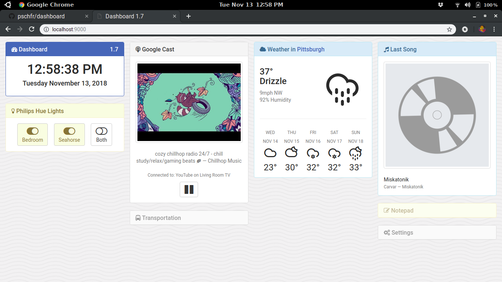

# Dashboard
Made with [`harp`](https://github.com/sintaxi/harp) and some magic ✨

This does a lot! Loads in the time, Philips Hue light status, weather from OpenWeatherMap, last song from Last.fm, Google Cast details, etc.

## Installing and Running
1. Clone the repo `git clone https://github.com/pschfr/dashboard`.
2. Install dependencies by running `npm install`.
3. Navigate to repo and run `npm run serve` and open `localhost:9000`!
